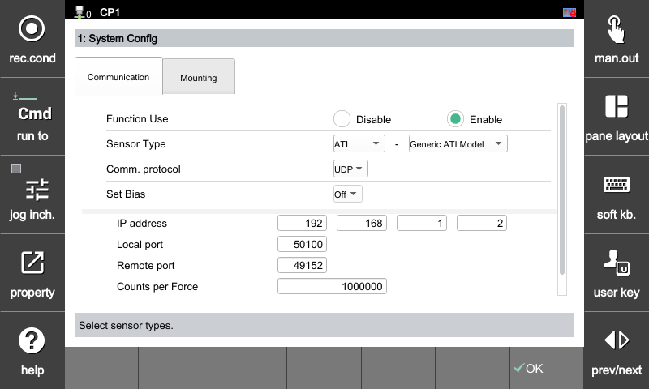
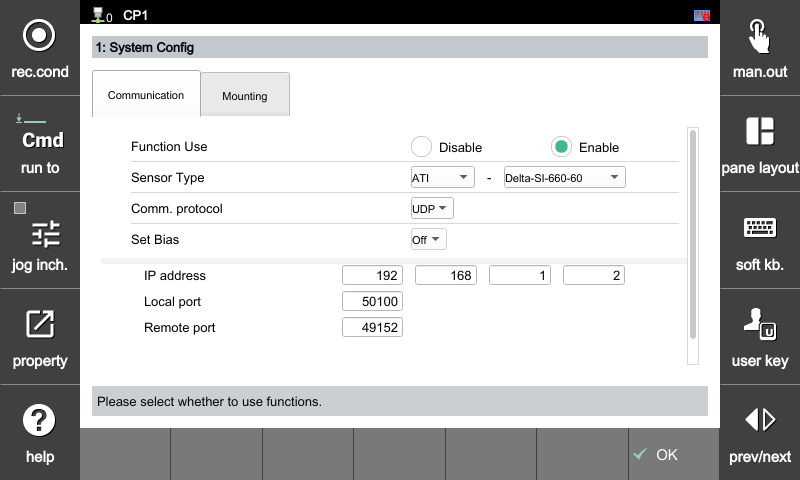
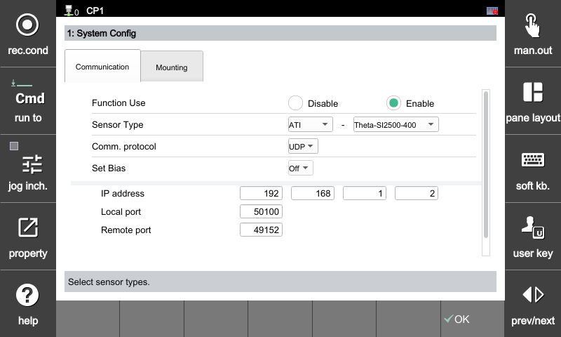
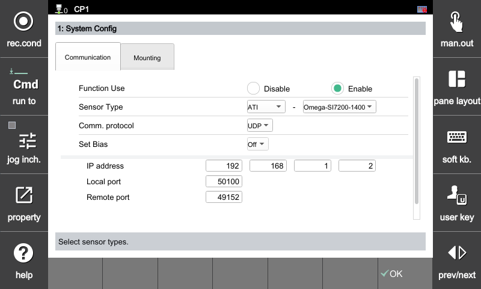

## 2.2.1 ATI Configuration

The model-specific configuration methods and communication parameters for ATI sensors are as follows.

---

##### **[Default Communication Parameters]**
All ATI sensor models use the same communication settings below.

* **Protocol:** UDP
* **IP Address:** 192.168.1.2
* **Remote Port:** 49152

---

##### **[Model-Specific Configuration Methods]**  

##### **1. ATI (Generic Model)**
This method does not register an individual model separately, but instead **the user manually enters and applies the model-specific scaling values provided by ATI**.

---

##### **2. ATI (Delta-SI-660-60)**
By using the dedicated Delta model profile pre-registered in the controller, optimized scaling values for the corresponding model are automatically applied.

---

##### **3. ATI (Theta-SI2500-400)**
By using the dedicated Theta model profile pre-registered in the controller, optimized scaling values for the corresponding model are automatically applied.

---

##### **4. ATI (Omega-SI7200-1400)**
By using the dedicated Omega model profile pre-registered in the controller, optimized scaling values for the corresponding model are automatically applied.



Since the Delta, Theta, and Omega models (excluding the Generic model) provide predefined parameters, malfunctions caused by incorrectly entered scaling values can be prevented.

