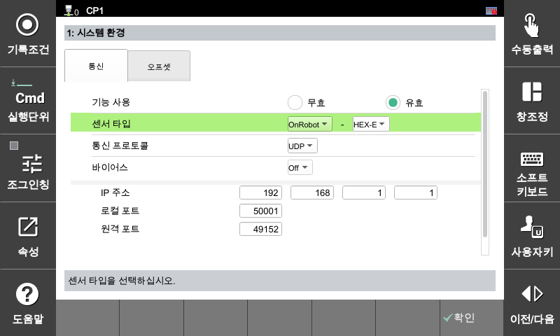

## 2.2.2 OnRobot 환경 설정

OnRobot 센서의 설정 방법 및 통신 파라미터는 다음과 같습니다.

### **[기본 통신 파라미터]**
OnRobot 센서를 제어기와 연결하기 위해 아래의 설정을 정확히 입력하십시오.

* **통신 프로토콜:** UDP
* **IP 주소:** 192.168.1.1
* **원격 포트:** 49152

---

### **[설정 방법]**

#### **OnRobot HEX (HEX-E / HEX-H) 설정**
OnRobot HEX 센서 모델을 사용하기 위한 환경 설정 화면입니다. 통신 파라미터 입력 후 설정이 정상적으로 반영되었는지 확인하십시오.

