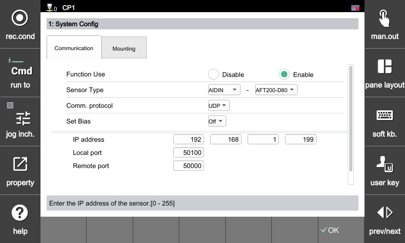

## 2.2.4 AIDIN Configuration

The configuration method and communication parameters for AIDIN sensors are as follows.

---

##### **[Default Communication Parameters]**

Enter the settings below accurately to connect the AIDIN sensor with the controller.

* **Protocol:** UDP
* **IP Address:** 192.168.1.199
* **Remote Port:** 50000

---

##### **AIDIN Sensor Configuration**

This is the configuration screen for using AIDIN 6-axis force/torque sensor models. Enter the designated IP address and remote port values without typos, and then save the settings.



Unlike other sensors, the AIDIN sensor **uses `50000` as its remote port number**. Please note that communication will not connect if you use the controller default values or a port from another manufacturer (49152).

Verify that the assigned unique IP address (`192.168.1.199`) does not conflict within the controller network band before proceeding with the configuration.

