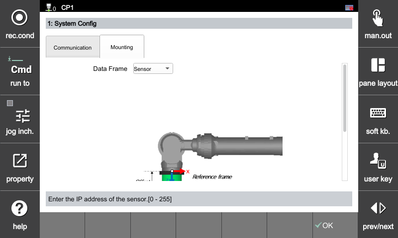
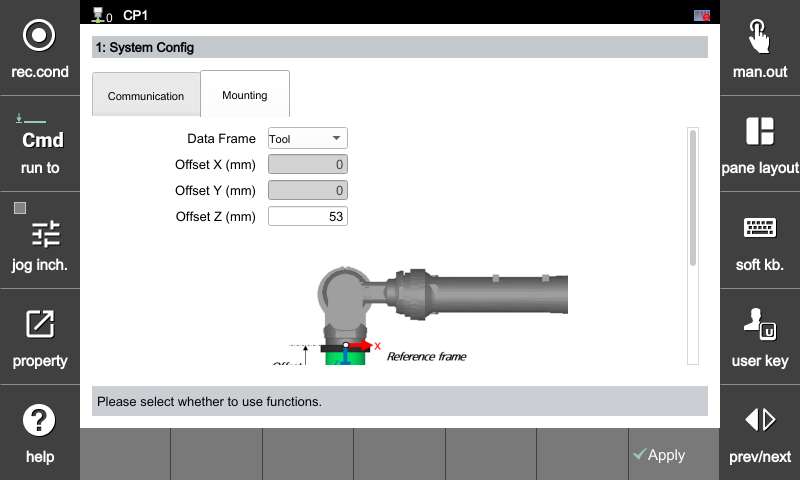
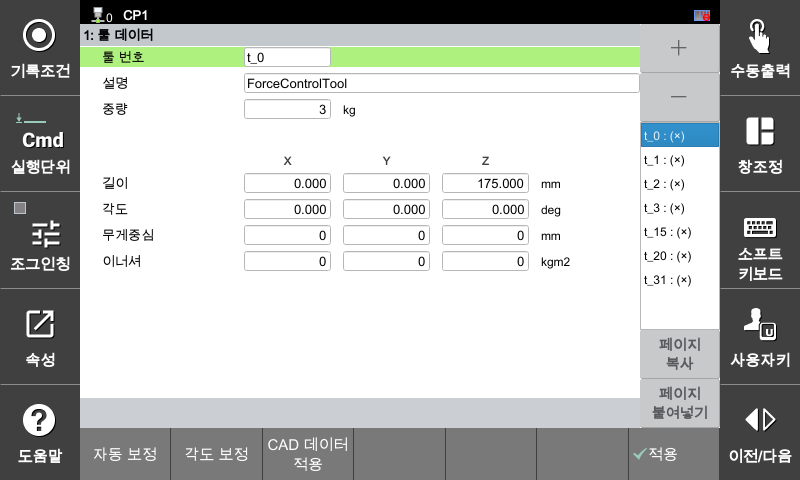

## 2.3 F/T 센서 오프셋 설정

실제 힘 제어(Force Control) 구동 시 제어 루프의 기준이 되는 **작업 좌표계**를 설정하고, 로봇 플랜지로부터 센서까지의 위치 오프셋을 입력하는 항목입니다.

[F2: 시스템] ➔ [4: 응용 파라미터] ➔ [24: 힘 제어] ➔ [1: 시스템 환경] ➔ **[오프셋] 탭 선택**

---

#### 힘 제어 구동 프레임 설정

힘 제어 알고리즘이 동작할 때 목표 힘(Target Force)을 추종 하기 위한 센서 데이터 기준 좌표계를 지정합니다. 

* **센서(Sensor) 프레임 기준:**
  로봇 끝단에 장착된 **F/T 센서 고유의 좌표계(Sensor Frame)**를 기준으로 힘 제어를 수행합니다. 툴 끝단(TCP)을 기준으로 힘을 제어해야 하는 환경에는 적합하지 않습니다.
* **툴(Tool) 프레임 기준:**
  F/T 센서에서 측정된 힘/토크 데이터를 **최종 TCP 끝단 좌표계로 변환**하여 힘 제어를 수행합니다. 툴 끝단을 기준으로 정밀한 힘 제어가 필요할 때 선택합니다.

--- 

#### 툴 프레임 설정을 위한 필수 조건

구동 프레임을 **'툴 프레임'** 기준으로 설정하여 정상적인 좌표 변환 연산을 수행하기 위해서는 아래 **2가지 기하학적 파라미터가 반드시 선행 설정**되어야 합니다.

#### 1. 센서 오프셋 길이 설정
로봇 플랜지면을 중심으로부터 F/T 센서 좌표계 중심까지의 정밀한 물리적 거리(Z)를 입력합니다. 현재는 플랜지 회전 중심축과 센서의 중심이 일치하는 상황에서만 기능을 지원 합니다. 

* **설정 범위:** `0.0` ~ `1000.0` (mm)

#### 2. 모션 툴 데이터(Tool Data) 설정
힘 제어가 실행되는 해당 프로그램 스텝(Move 명령)에 지정된 툴 번호의 **TCP 길이 및 방향**이 정확하게 입력되어 있어야 합니다. 제어기는 이 데이터를 기반으로 플랜지에서 TCP 끝단까지의 상대 좌표를 계산합니다.

[F2: 시스템] ➔ [3: 로봇 파라미터] ➔ [1: 툴 데이터]



구동 프레임을 **툴 프레임**로 설정한 상태에서 유효하지 않은 툴 번호를 사용하거나, 툴 데이터(TCP) 값이 실제와 다를 경우, 좌표 변환 오차로 인해 힘 제어 구동 시 시스템이 오동작하거나 발산할 수 있습니다.

파라미터 설정을 변경한 후에는 반드시 화면 하단의 **[적용/확인]** 버튼을 눌러 제어기에 최종 반영합니다.



