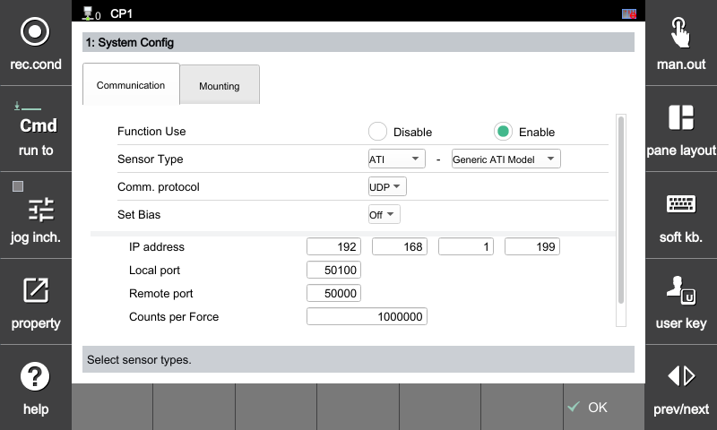
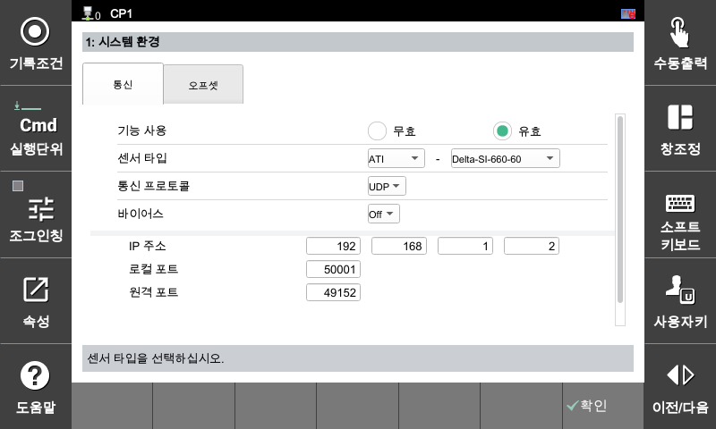

## 2. Configuration

To use the sensor-based force control function, the following key items must be configured. These items serve as the **criteria** for all controller operations.

---

#### **Setting Menu Access Path**

The force control environment settings can be accessed through the following path on the teaching pendant.

> [F2: System] ➔ 4: Application Parameter ➔ 24: Force Control ➔ 1: System Config 

---

#### **Function Enable/Disable Settings**

Determines whether to globally activate the sensor-based force control function. To normally operate the force control loop within the system, it **must be set to `Enable`**.

* **Enable:** Activates the force control function (runs the real-time loop)
* **Disable:** Deactivates the force control function (operates in normal position control mode)

 

**[Setting Screen Example]**

* **Function Deactivated State `Disable`**
  
  

* **Function Activated State `Enable`**
  
  

 

After activating the function by setting the function usage to **`Enable`**, proceed with the configuration of the sensor communication information and tool offset (length).

---



**Prerequisites**
The function usage must be changed to `Enable` and applied before you can proceed with the subsequent steps of sensor parameter configuration, communication connection, and dynamic load identification (calibration).

