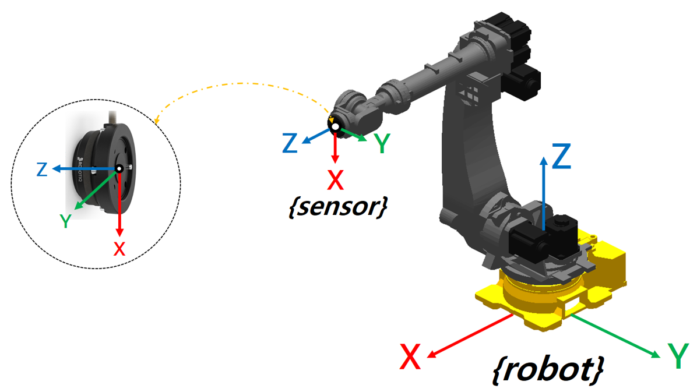

## 2.1 힘 센서 좌표계 

FT 센서를 장착할 때, 센서 좌표계는 반드시 로봇 모델과 일치하도록 설정해야 합니다. 

센서 좌표계 오설정 시, 측정된 힘/토크 방향이 실제와 달라져 제어 성능이 크게 저하됩니다.

 

---

### **로봇의 센서 좌표계**

- 자사에서 설정한 센서 좌표계 X, Y, Z 축은 아래  그림과 같이 정의됩니다: 

- 센서 모델에서 설정된 X, Y, Z 방향과 로봇의 센서 좌표계 방향이 동일해야 합니다.  

- 위 그림에서 로봇은 기본 자세입니다. 

- 일반적인 원형 FT 센서의 좌표계는 모델 옆면에 표시가 되어 있습니다.  

 

---



 - **좌표계가 반대일 경우**: 축 반전을 고려해 소프트웨어에서 변환해야 함
 - **툴 무게 중심 입력 시**: 센서 기준 좌표계로 입력할 것
 - **센서 제로 보정** 전, 올바른 방향인지 확인할 것



---
