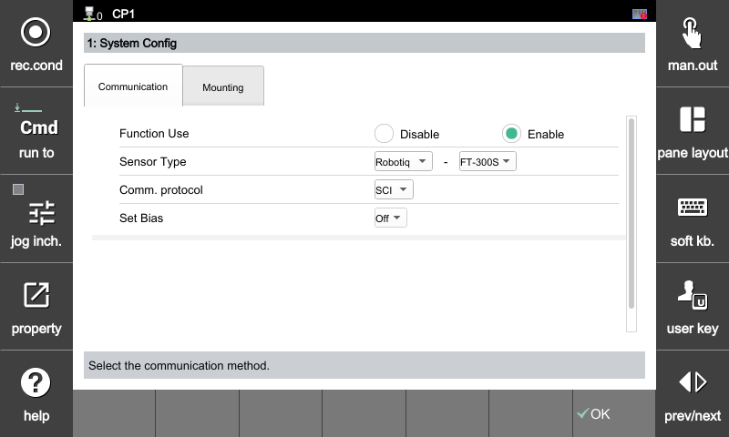
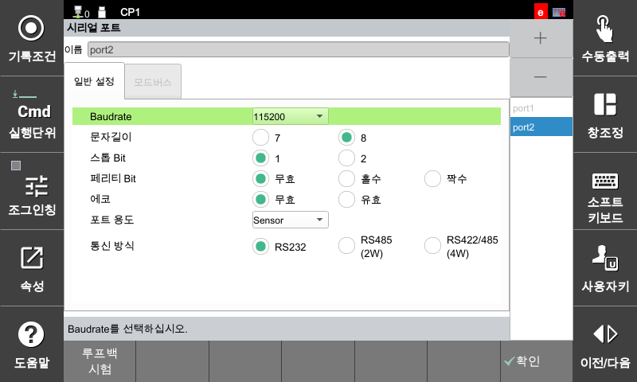

## 2.2 힘 제어 환경 설정

센서 기반 힘 제어 기능을 사용하기 위해 아래의 주요 항목들을 설정해야 합니다.  
이 항목들은 제어기의 모든 동작의 **출발점**이 됩니다. 

힘 제어 환경 설정은 아래 경로를 통해 진입할 수 있습니다: 

[F2: 시스템] – 4: 응용파라미터 – 17: 힘제어 – 1: 사용자 환경 설정

 

---

### **기능 사용**

센서 기반 힘 제어 기능의 사용 여부를 설정합니다.

- `유효`: 기능 **활성화** 
- `무효`: 기능 **비활성화** 

>  반드시 Enable로 설정해야 힘 제어 기능이 작동합니다.

---

### **센서 제조사 및 모델**

사용할 **힘 센서의 제조사 및 모델**을 선택합니다.

- 예시:
  - `ATI : 일반 ATI 모델`
  - `ATI : Delta-SI-660-60`
  - `ATI : Theta-SI2500-400`
  - `ATI : Omega-SI7200-1400` 
  - `OnRobot : HEX-E` 
  - `Robotiq : FT-300S` 

센서에 따라 **데이터 포맷 및 통신 방식**이 달라지므로 정확히 선택해야 합니다.

> **참고 사항**  
> 다음 ATI 모델은 **V60.32-05 이상 버전**에서 지원됩니다.  
> - 일반 ATI 모델  
> - Theta-SI2500-400  
> - Omega-SI7200-1400

--- 

### **통신 프로토콜**

선택한 센서에서 제공하는 **통신 방식**을 설정합니다.

- `UDP`
- `SCI`
- `TCP`

프로토콜에 따라 포트 설정 및 내부 파싱 방식을 아래와 같이 설정

--- 
### **ATI 모델별 설정 방법**

- **통신 프로토콜** : `UDP`
- **IP 주소** : `192.168.1.2`
- **원격 포트** : `49152`

 

#### **ATI(Delta-SI-660-60)**  

 

#### **ATI(Theta-SI2500-400)**

 

#### **ATI(Omega-SI7200-1400)**

 

#### **ATI(일반 ATI 모델)**

- **일반 ATI 모델**
  - 모델을 별도로 개별 등록하지 않고, **ATI에서 제공하는 모델별 스케일링 값을 사용자가 직접 수동 입력하여 적용하는 방식**입니다.

---

### **OnRobot HEX-E 설정 방법**

- **통신 프로토콜** : `UDP`
- **IP 주소** : `192.168.1.1`
- **원격 포트** : `49152`

---

### **SCI 통신 방식 : Robotiq(FT-300S)**

[F2: 시스템] – 2: 제어파라미터 – 3: 시리얼포트 – 1: 환경설정

---

 


> - 본 설정은 *일반적인 모델 기준 예시*입니다.  
> - **ATI 일부 모델은 상기 설정과 상이한 네트워크 값을 사용할 수 있습니다.**  


