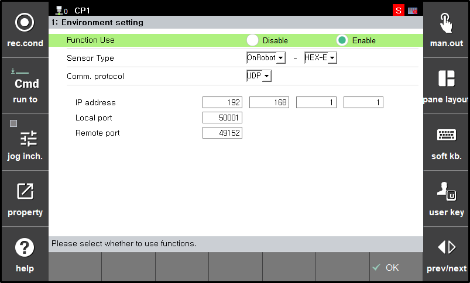
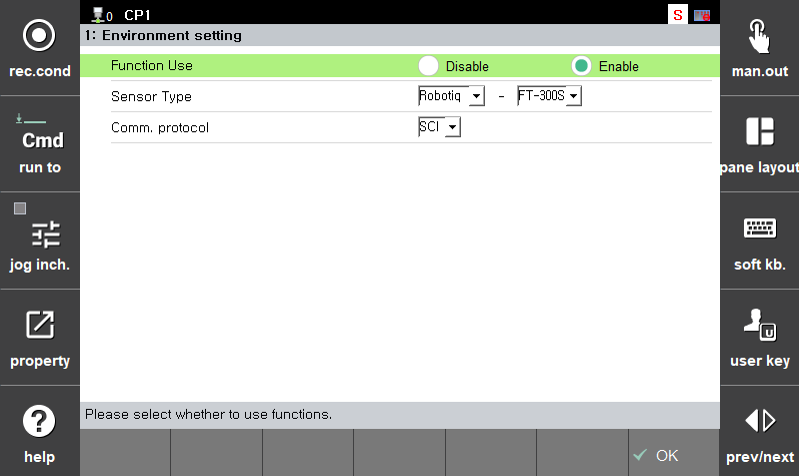
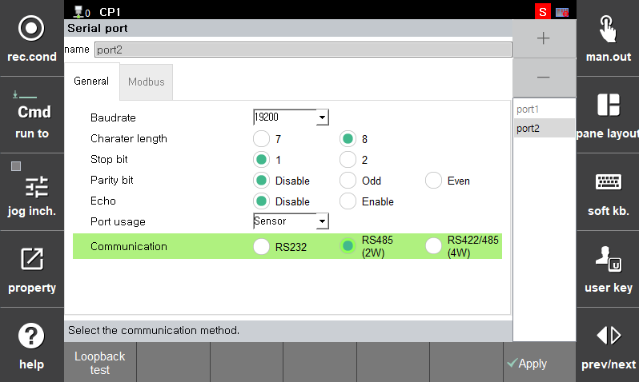

## 🧩 2.4 힘 제어 환경 설정

센서 기반 힘 제어 기능을 사용하기 위해 아래의 주요 항목들을 설정해야 합니다.  
이 항목들은 제어기의 모든 동작의 **출발점**이 됩니다. 

힘 제어 환경 설정은 아래 경로를 통해 진입할 수 있습니다: 

📂 시스템 → ⚙️ 4: 응용파라미터 → 💪 17: 힘제어 → 🛠 1: 환경 설정

 

---

### ✅ **Function Use**

센서 기반 힘 제어 기능의 사용 여부를 설정합니다.

- `Enable`: 기능 **활성화** 
- `Disable`: 기능 **비활성화** 

> ⚠️ 반드시 Enable로 설정해야 힘 제어 기능이 작동합니다.

---

### ✅ **Sensor Type**

사용할 **힘 센서의 제조사 및 모델**을 선택합니다.

- 예시:
  - `ATI : Delta-SI-660-60` 
  - `OnRobot : HEX-E` 
  - `Robotiq : FT-300S` 

센서에 따라 **데이터 포맷 및 통신 방식**이 달라지므로 정확히 선택해야 합니다.

> 💡 센서 이름은 UI에서 자동으로 등록된 리스트로 제공됩니다.

--- 

### ✅ **Comm. protocol**

선택한 센서에서 제공하는 **통신 방식**을 설정합니다.

- `UDP`
- `SCI`
- `TCP`

⚙️ 프로토콜에 따라 포트 설정 및 내부 파싱 방식을 아래와 같이 설정

--- 

### ✅ **UDP 통신 방식 : OnRobot(HEX-E)**

---

### ✅ **SCI 통신 방식 : Robotiq(FT-300S)**

 

📂 시스템 → 🔧 2: 제어파라미터 → 🔌 3: 시리얼포트 → 🛠 1: 환경설정

 

 💡 *Function Use*, *Sensor Type*, *Comm. protocol*, IP 주소 등을 반드시 정확히 입력해야 센서가 정상 작동합니다.