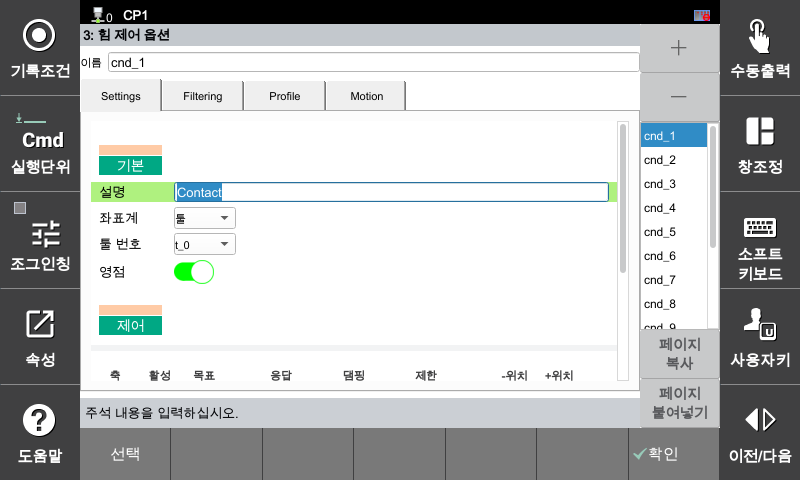

## 🧩 2.4.2 힘 제어 조건 설정-기본

작업에 따라 제어할 축을 선택하고, 축별로 힘 목표값, 강성(Stiffness), 속도, 위치 제한(Pose limit)을 설정합니다.  
이 항목은 힘 제어의 핵심이며, 실제 로봇 동작의 반응성을 결정합니다.

 

---

  

### ✅ **기본(Default) 설정 항목**

| 항목             | 설명 |
|------------------|------|
| **이름(Name)**       | 조건 이름 (예: `cnd_12`) – 목록에서 선택하여 자동 입력 |
| **설명(Description)**| 작업 설명 (예: `Sanding`) – 현재 조건의 용도 구분용 |
| **좌표계(Crd)** | 힘 제어가 적용될 좌표계 선택 • `Base` (베이스 좌표) • `Robot` (로봇 좌표) • `Tool` (툴 좌표) • `User` (사용자 정의 좌표) |
| **사용자 좌표계(UCS ID)**     | 사용자 정의 좌표계 번호 – Crd가 `User`일 경우 사용 |
| **툴 좌표계(Tool ID)**    | 현재 사용하는 툴 번호 (툴 무게, 중심 정보 연결)   |
| **영점 기능(Zeros)**      | 힘 센서 초기값 보정 (영점 설정) • `On`: 제로 보정 실행 • `Off`: 원래 값 유지 |

>💡 사용자 좌표계를 선택하고, 존재 하지 않는 사용자 좌표계 번호(ID)를 입력하고 힘 제어 동작시 에러를(E1336) 출렵 합니다. 

>💡 사용자 좌표계를 선택하고, 사용자 좌표계 번호(ID)를 0으로 입력하면 로봇 좌표계와 동일 합니다. 

>💡 툴 좌표계 번호(ID)는 "📂 시스템 → ⚙️ 4: 응용파라미터 → 💪 17: 힘제어 → 🧰 2: 툴 정보 설정" 에서 설정된 툴 번호를 의미 합니다

>💡 영점 기능을 사용 하지 않으면(`Off`), 센서에서 출력된 값에 설정된 툴 번호 정보(`무게 및 중심`)를 기준으로 보정된 값을 출력 합니다. 

  

### ✅ 기본 항목 설정 예시

> 예: `Sanding 작업용 조건`
>
> - **이름(Name)**: `cnd_12`  
> - **설명(Description)**: `Sanding`  
> - **좌표계(Crd)**: `Tool` 좌표계로 선택  
> - **툴 좌표계(Tool ID)**: `0`번 힘 제어 툴 정보(질량/중심) 사용  
> - **영점 기능(Zeros)**: `ON` (힘 제어 동작 시 0으로 초기화된 센서 데이터값 사용)  

---