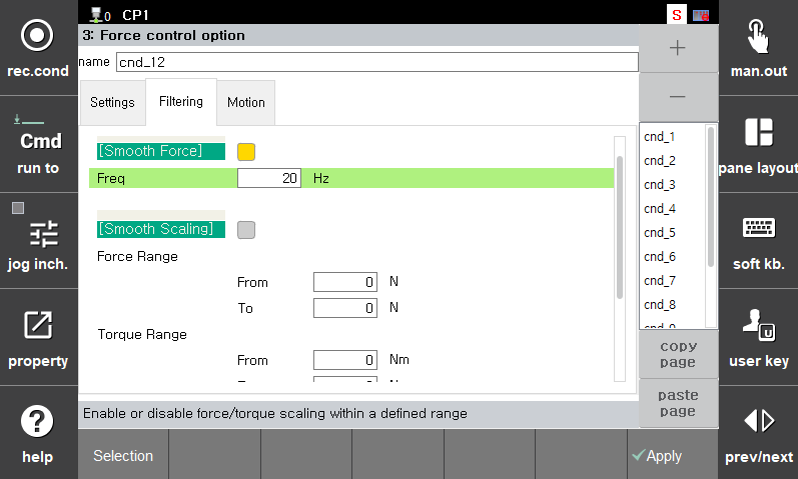
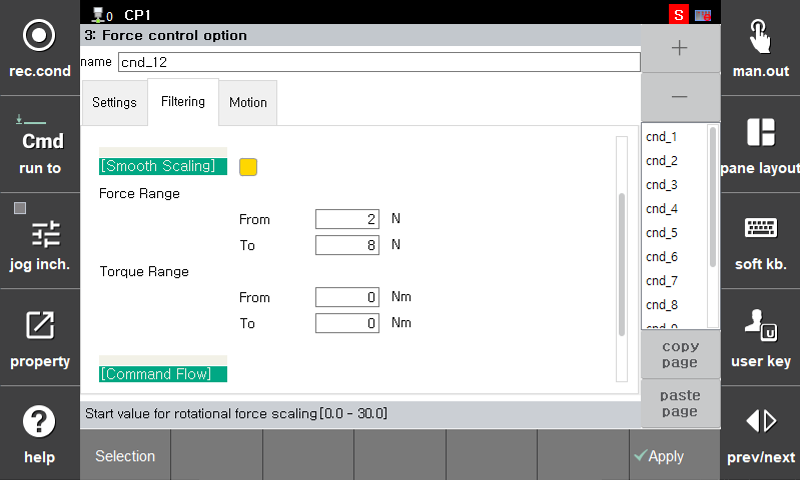
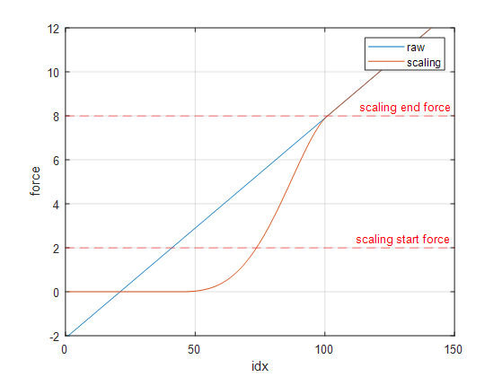
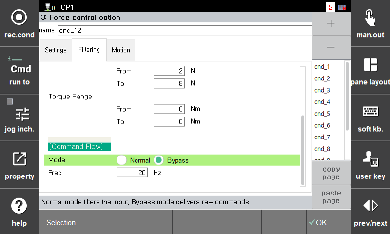

## 2.4.3 Force Control Condition - Filtering

Filtering functions are provided to reduce noise from the force sensor and ensure stable input for control.  
Additional features include a **scaling option** that adjusts control intensity within a specific force/torque range,  
and a **bypass option** for more sensitive response to minor inputs.

 

---

### Smooth Force (Filtering)

Applies a **filter** to the sensor's force signal to reduce fluctuation and ensure smoother control.

| Item              | Description |
|-------------------|-------------|
| **Enable**        | Apply filtering when checked |
| **Frequency (Freq)** | Cutoff frequency of the filter (e.g., 20 Hz) → Lower values provide smoother output but slower response |

 

---

### Smooth Scaling

Smoothly adjusts the control response within a defined range of force or torque.  
Useful in tasks requiring fine sensitivity tuning; typically left disabled by default.  
The system can be configured to ignore minor force changes and only respond to forces above a certain threshold.

| Item              | Description |
|-------------------|-------------|
| **Enable**        | Apply scaling within the range when checked |
| **Force Range**   | Target force range (e.g., 2 ~ 8 N) |
| **Torque Range**  | Target torque range (e.g., 0 ~ 0 Nm) |

> 💡 If the input force is below the start value, the output is set to 0.  
> 💡 If the input force is above the end value, the original input value is used.  
> ⚠️ If the start and end values are the same, scaling will not be applied.

 

---

### Command Flow

Configures how command signals are processed and delivered to the robot.

| Item     | Description |
|----------|-------------|
| **Mode** | `Normal`: Standard command delivery method `Bypass`: Immediate and sensitive command response |
| **Freq** | Filter frequency used in `Bypass` mode (Hz) |

> **Bypass** mode is used to **reflect sensor data immediately** and is recommended only for highly sensitive or experimental use cases.  
> ⚠️ May cause **noise or vibration**, so `Normal` mode is recommended for standard operations.

---

 

### Recommended Settings Guide

| Task Type           | Recommended Settings                            |
|---------------------|-------------------------------------------------|
| Polishing / Sanding | `Smooth Force = ON`, `Freq = 20 Hz`             |
| Delicate Assembly   | `Smooth Scaling = ON`, with conservative range  |
| High Responsiveness / Testing | `Command Flow = Bypass`               |

---

📎 **Filtering**, **Scaling**, and **Command Flow** settings all work together.  
They should be **tuned as a whole** depending on the specific task requirements.