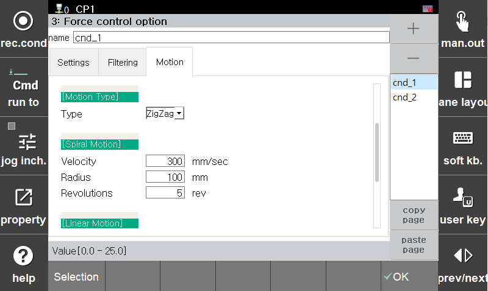
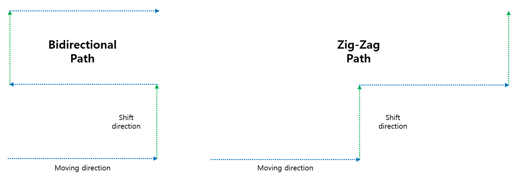
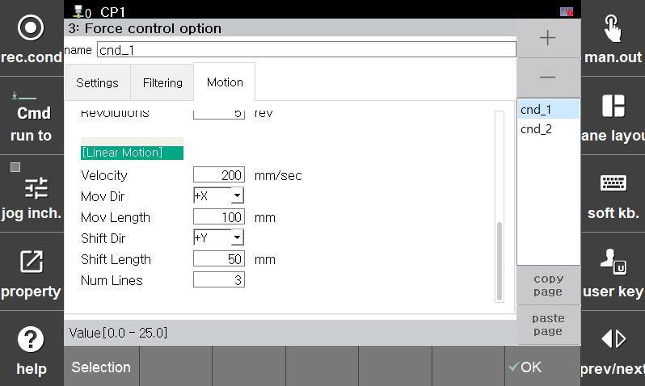

## 2.4.4.2 Force Control Condition - Motion - Auto Trajectory Generation

Motion control conditions can be configured to run in conjunction with force control operations.

In particular, this section allows the configuration of **Spiral**, **Bidirectional**, and **Zigzag** path trajectories.

 

---

  

### Motion Type

| Type             |
|------------------|
| **Spiral Motion** |
| **Bidirectional Motion** |
| **Zigzag Motion** |

---

 

### Spiral Motion

Generates a spiral path and trajectory.

| Item            | Description |
|------------------|-------------|
| **Velocity**      | Linear rotational velocity (mm/s) |
| **Radius**        | Maximum spiral radius (mm) - defines the final spiral size |
| **Revolutions**   | Number of full rotations (rev) |

---

### Bidirectional Motion

Generates a linear raster path that alternates direction line-by-line.

| Item            | Description |
|------------------|-------------|
| **Velocity**       | Linear velocity along the path (mm/s) |
| **Mov Dir**        | Movement direction (+X, -X, +Y, -Y) |
| **Mov Length**     | Length of each movement line |
| **Shift Dir**      | Line shift direction (+X, -X, +Y, -Y) |
| **Shift Length**   | Distance between raster lines |
| **Num Lines**      | Number of lines to generate in movement direction |

---

### Zigzag Motion

Generates a raster path that alternates direction every line (zigzag pattern).

| Item            | Description |
|------------------|-------------|
| **Velocity**       | Linear velocity along the path (mm/s) |
| **Mov Dir**        | Movement direction (+X, -X, +Y, -Y) |
| **Mov Length**     | Length of each movement line |
| **Shift Dir**      | Line shift direction (+X, -X, +Y, -Y) |
| **Shift Length**   | Distance between raster lines |
| **Num Lines**      | Number of lines to generate in movement direction |

---

📌 The above motions generate XY-plane trajectories relative to the coordinate system selected in **Section 2.4.1**.
