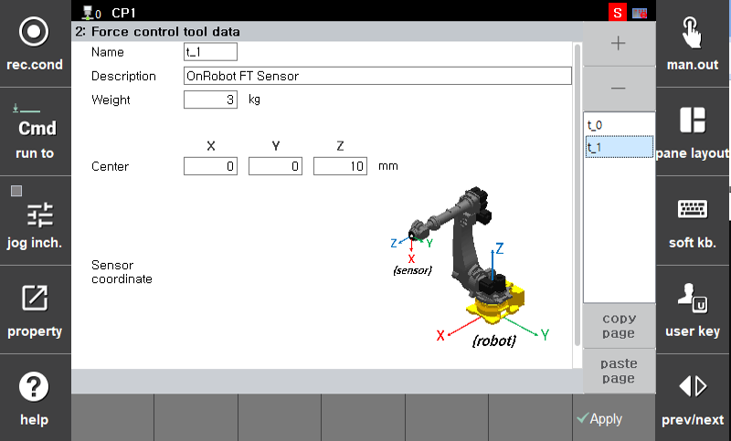

## 2.3 力控制工具信息

通过输入安装在机器上的工具的物理特性，力控制算法的准确性得以提高。  
传感器感知的力和扭矩是基于工具的重量和重心坐标进行校准的。

力控制工具信息设置可以通过以下路径访问：

`[F2: 系统] – 4: 应用参数 – 17: 力控制 – 2: 力控制工具数据`

 

---

| 项目 | 描述 |
|--------------|------|
| **名称** | 工具数据名称（自动输入） |
| **描述** | 工具描述或用途（可选输入） |
| **重量 [kg]** | 工具的重量。在计算力误差时用于重力补偿。 |
| **中心 [X, Y, Z]** | 工具重心的位置（基于传感器，单位：毫米） |
| **传感器坐标** | 传感器参考坐标系的方向（参考用户界面右侧的图像） |



 - 最多可以配置10组工具信息。  
 - Hi5a提供的基于传感器的负载估计功能目前不被支持。

