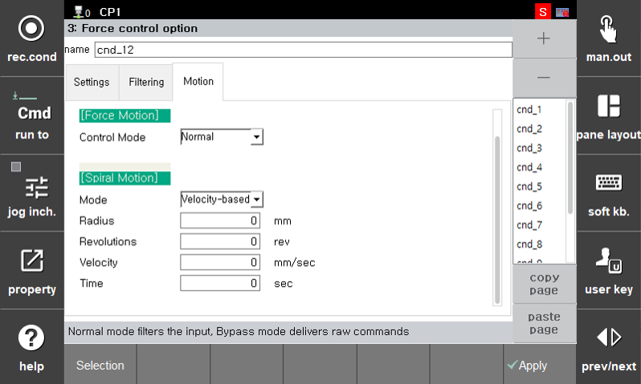

## 🧩 3. 명령문   

힘 제어 동작 시 함께 수행할 모션 제어 조건을 설정할 수 있습니다.  

특히 **나선형 모션(Spiral Motion)**  경로와 궤적 설정이 이곳을 통해 이루어집니다.

 

---

### ✅ 힘 모션[Force Motion]

| 항목명         | 설명 |
|----------------|------|
| **제어 모드(Control Mode)** | 힘 제어 중 모션 실행 방식 선택 • `Normal`: 기본 힘 제어 모드  |

> 💡 일반적인 힘 제어 모드는 `Normal`로 사용됩니다. 

> 💡 추후 버전 업데이트에 따라 신규 모드 생성이 됩니다.  

 

---

### ✅ 나선형 모션[Spiral Motion]

나선형 경로와 궤적을 생성하는 기능입니다.  

| 항목명       | 설명 |
|--------------|------|
| **Mode**      | 나선 경로 생성 기준 • `Velocity-based`: 속도 기준 경로  생성  • `Time-based`: 시간 기준 경로 생성 |
| **Radius**    | 최대 반지름 설정 (단위: mm) – 최종 나선의 크기 |
| **Revolutions** | 회전수 (rev) – 전체 몇 바퀴 도는지 |
| **Velocity**  | 회전 선속도 (mm/s) – `Velocity-based` 모드에서 사용됨 |
| **Time**      | 전체 나선 동작 시간 (sec) – `Time-based` 모드에서 사용됨 |

 

---

### ✅ 설정 예시 

> 예: 일정한 힘으로 접촉면을 나선형으로 이동하며 연마

| 항목             | 설정 값 |
|------------------|---------|
| 제어모드(Control Mode)     | `Normal` |
| 나선형 모드(Mode)          | `Velocity-based` |
| 최대 반지름(Radius)           | `20` mm |
| 총 회전수(Revolutions)      | `3` 회 |
| 선 속도(Velocity)         | `10` mm/s |
| 시간(Time)             | `0` sec (사용 안 함) |

 

📌 `나선형 모션`(Spiral Motion)은 2.4.1에서 선택된 좌표계 기준으로 XY 평면 기준으로 경로를 생성 합니다.  