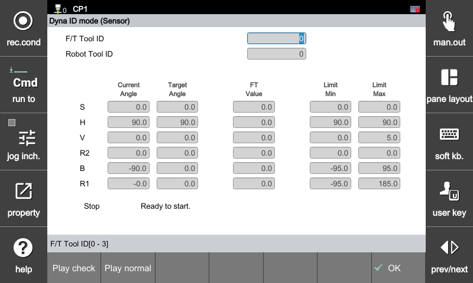
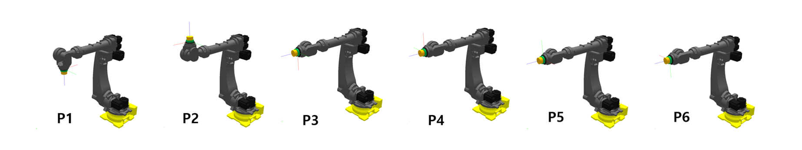
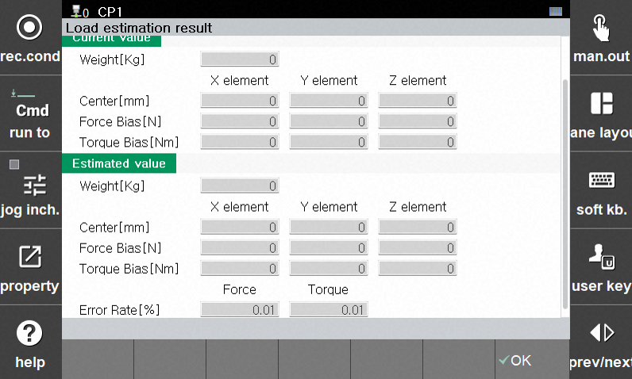

## 3.2 동적 부하 식별 기능 

로봇 말단에 장착된 F/T 센서의 데이터를 실시간으로 분석하여, 부착된 툴(Payload)의 물리적 특성인 **질량(Mass), 무게 중심(CoG), 그리고 센서 바이어스(Sensor Bias)** 를 일련의 캘리브레이션 모션을 통해 정밀하게 식별하는 기능입니다.



해당 기능은 제어기 소프트웨어 **V70.02-00 이상** 버전부터 지원됩니다.



동적 부하 식별 기능은 아래 경로를 통해 진입할 수 있습니다:

[F2: 시스템] ➔ [4: 응용 파라미터] ➔ [24: 힘 제어] ➔ [2: 툴 데이터] ➔ **[F1: 동적 부하 식별]**

---

##### **[UI 설정 및 상태 표기 항목]**

| 실행 항목 | 설명 |
| :--- | :--- |
| **힘 제어 툴 번호** | 동적 부하 파라미터를 식별 및 저장할 대상 번호입니다. **물리적으로 F/T 센서 전단(앞단)에 부착된 순수 툴(Payload)** 을 의미합니다. |
| **로봇 모션 툴 번호** | 동적 식별 모션 구동 시 기준이 되는 툴 번호입니다. **물리적으로 F/T 센서 자체의 위치 및 무게까지 포함하는 통합 툴 정보**를 의미합니다. |
| **현재 각도 / 목표 각도** | 식별 구동(확인/정상 운전) 진행 시, 각 로봇 축의 현재 실시간 각도와 매칭되는 목표 포즈 각도를 표시합니다. |
| **센서 데이터** | 구동 중 F/T 센서로부터 수집되는 실시간 힘(Force) 및 토크(Torque) 데이터 피드백을 표시합니다. |
| **Limit Min / Max** | 식별 모션이 안전하게 구동될 수 있도록 소프트웨어적으로 제한하는 로봇 축별 최소/최대 가동 한계 각도입니다. |
| **확인 운전** | 실제 부하를 식별하기 전, 로봇의 이동 경로 상의 주변 간섭 유무와 센서 케이블의 장력(당겨짐)을 사전에 점검하는 테스트 구동입니다. |
| **정상 운전** | 확인 운전이 알람 없이 정상 종료된 후 활성화되며, 실제 F/T 센서 데이터를 고속 수집하여 부하 파라미터를 계산하는 실효 식별 구동입니다. |



**로봇 모션 툴 입력 순서 가이드:**

  1. **식별 전:** '로봇 모션 툴 번호'에는 대략적인 무게 정보만 우선 입력한 뒤 구동합니다.

  2. **식별 후:** 동적 부하 식별이 완료되면, 측정된 결과에 F/T 센서 자체의 자중(Weight) 및 무게중심(CoG)을 최종 합산하여 데이터를 업데이트하십시오.



---

##### **[식별 모션 및 포즈]** 

확인 운전 및 정상 운전 실행 시, F/T 센서의 다축 중력 방향 매칭 데이터를 정밀 획득하기 위해 로봇의 손목 축(4, 5, 6축)이 사전에 정의된 6가지 기본 포즈로 순차 자동 구동됩니다.

* **P1:** `[0, 90, 0, 0, -90, 0]`
* **P2:** `[0, 90, 0, 0, 90, 0]`
* **P3:** `[0, 90, 0, 0, 0, 0]`
* **P4:** `[0, 90, 0, 0, 0, 180]`
* **P5:** `[0, 90, 0, 0, 0, 90]`
* **P6:** `[0, 90, 0, 0, 0, -90]`



**수동 구동 필수 조건:** 확인/정상 운전을 실행하려면 제어기 모드 스위치가 **[수동(MANUAL)]** 상태여야 하며, 모터 ON 및 티칭 펜던트(TP)의 **이네이블 스위치(Deadman Switch)가 On(눌림)** 상태를 유지해야 합니다.

**주변 환경 점검:** 구동 시작 전, F/T 센서 케이블의 여유 길이를 확인하여 회전 시 꼬임이나 당겨짐이 없는지 점검하고, 로봇 본체 및 툴이 주변 구조물이나 안전 펜스에 충돌하지 않도록 모션 반경 내 작업 영역을 충분히 확보하십시오.



##### **[작동 순서 및 절차]** 

###### **1 단계: 확인 운전**
* **목적:** 추종시 로봇 움직임이 안전하게 수행될 수 있도록 주변 공간 및 간섭 여부를 먼저 점검하는 단계입니다.

* **역활:** 본격적인 식별 모션 전, 로봇이 주변 설비나 기구부와 충돌 경로가 없는지 낮은 속도로 확인합니다.

###### **2 단계: 정상 운전**
* **목적:** F/T 센서 데이터 기반으로 툴의 중량 및 중심 위치를 실시간 연산하기 위한 다축 식별 모션을 구동합니다.

* **역활:** 로봇이 사전에 정의된 각도 변위로 다양하게 자세를 변경하며 센서에 인가되는 자중 분력을 측정합니다.

###### **3 단계: 결과 확인**
* 측정이 완료되면 팝업 창을 통해 현재 적용된 `기존 값`과 센서 기반으로 새로 계산된 `추정 값`이 화면에 표시됩니다.

| 실행 항목 | 설명 |
| :--- | :--- |
| **무게 [Kg]** | 추정된 툴의 전체 질량입니다. |
| **중심 [mm]** | 센서 좌표계 원점 기준 툴의 X, Y, Z 방향별 무게 중심 위치입니다. |
| **힘/토크 바이어스** | 센서 고유의 제로 오프셋(Bias) 누적 값입니다. |
| **오차율 [%]** | 식별 궤적 내 데이터 신뢰도 및 오차율을 나타내며, Force와 Torque 각각 표시됩니다. |

###### **4 단계: 데이터 적용**
* 화면 우측 하단의 **[✓ OK]** 버튼을 누르면 새롭게 추정된 `추정 값` 정보가 해당 힘 제어 툴 데이터에 최종 저장 및 반영됩니다.



**안전 유의 사항:** 2단계 `정상 운전` 진행 중에는 로봇이 다축 반전 거동을 수행하므로, 반드시 툴 주변의 간섭 영역을 완전히 확보한 상태에서 구동해야 합니다.

**오차율 만족 기준:** 측정된 **오차율은 반드시 5% 이내를 만족**해야 합니다.

**트러블슈팅 팁:** 만약 오차율이 5%를 초과하여 비정상적으로 높게 출력된다면 측정 중 외부 간섭이 있었거나 센서 케이블 장력이 작용한 상태일 수 있습니다. 센서 케이블의 여유 및 간섭을 재점검한 후 다시 측정하십시오.



---