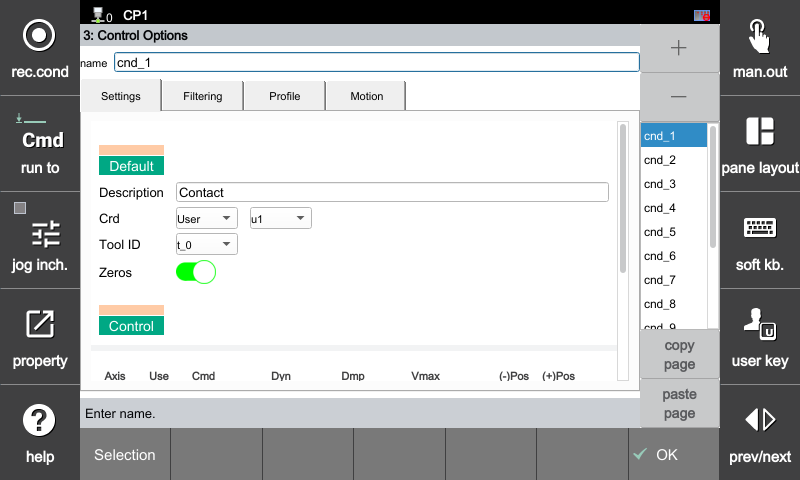

### 4.1 기본

힘 제어 구동 조건에 따른 이름을 설정하고, 제어 기준이 될 작업 좌표계와 툴 번호 및 센서 영점(오프셋) 기능을 설정하는 메뉴입니다. 

힘 제어 옵션 조건 설정은 아래 경로를 통해 진입할 수 있으며, 최대 15개까지 구성할 수 있습니다.

[F2: 시스템] ➔ [4: 응용 파라미터] ➔ [24: 힘 제어] ➔ [3: 힘 제어 옵션] ➔ **[Settings] 탭 선택**

 

---

 

#### **기본(Settings) 설정 항목**

| 항목 | 설명 |
| :--- | :--- |
| **이름** | 힘 제어 조건의 식별 명칭입니다. 우측 리스트 목록에서 선택 시 자동으로 입력됩니다. (예: `cnd_1`) |
| **설명** | 현재 제어 조건의 용도나 작업 내용을 입력합니다. (예: `Contact`, `Sanding` 등) |
| **좌표계** | 힘 제어 루프가 적용될 기준 좌표계를 선택합니다. • **베이스**  • **로봇**  • **툴**  • **사용자** |
| **사용자 좌표 번호** | 좌표계를 **[사용자]**로 선택했을 때 활성화되며, 적용할 사용자 좌표계의 고유 ID 번호를 지정합니다. |
| **툴 번호** | 현재 제어에 적용할 툴 데이터 번호를 선택합니다. (해당 툴에 설정된 무게 및 중심 정보가 제어 알고리즘에 실시간 연동됨) |
| **영점** | 힘 제어 시작 시 센서 데이터의 초기 오프셋을 강제로 상쇄할지 여부를 토글 스위치로 설정합니다. • **On (활성화):** 구동 직전 센서 값을 0으로 리셋(소프트웨어 바이어스 처리) • **Off (비활성화):** 별도의 제로 보정 없이 기존 센서 데이터 유지 |

  

---



**사용자 좌표계 입력 주의 사항:** 사용자 좌표계를 선택한 상태에서 번호(ID)를 **미설정(None)** 으로 지정할 경우, **로봇 좌표계**와 동일하게 매칭되어 연산됩니다.

**툴 번호 연동:** 여기서 선택하는 툴 번호(ID)는 `[F2: 시스템] ➔ [4: 응용 파라미터] ➔ [24: 힘 제어] ➔ [2: 툴 데이터]` 메뉴에 사전 등록된 툴 데이터 번호의 물리 파라미터를 의미합니다.

**영점 기능 Off 시 동작:** 영점 기능을 사용하지 않으면(Off), 센서 원시 출력 데이터에 미리 매칭된 툴 데이터 정보(중량, 중심, 힘/토크 영점)만을 기준으로 툴 자중을 상쇄한 정적 보정값을 사용하게 됩니다. 

