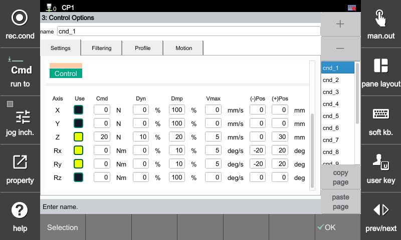

### 4.2 제어

힘 제어를 적용할 자유도(축)를 선택하고, 목표 힘/토크 및 가상 시스템의 응답성, 점성 저항(댐핑), 속도 및 변위 한계값을 설정하는 메뉴입니다. 실제 로봇이 환경과 접촉할 때의 유연성과 반응 속도를 결정하는 핵심 파라미터입니다.

[F2: 시스템] ➔ [4: 응용 파라미터] ➔ [24: 힘 제어] ➔ [3: 힘 제어 옵션] ➔ **[Settings] 탭 선택**

---

#### **제어(Control) 설정 항목**

| 항목 | 설명 |
| :--- | :--- |
| **축** | 제어 대상이 되는 6자유도 축을 나타냅니다. (X, Y, Z: 선속도 방향 / Rx, Ry, Rz: 회전 방향) |
| **활성** | 해당 축의 힘 제어 활성화 여부를 지정합니다. 활성화 시 박스가 **노란색**으로 점등됩니다. |
| **목표** | 목표 힘(단위: N) 또는 목표 토크(단위: Nm)를 입력합니다. |
| **응답** | 외력 또는 목표값 변화에 대한 로봇의 초기 반응성(%)을 조절합니다. 설정값이 **낮을수록 제어 반응 속도가 빨라져 목표값에 민첩하게 도달**합니다. |
| **댐핑** | 가상 점성 감쇠 계수와 매칭되는 댐핑 비율(%)입니다. 설정값이 **낮을수록 외력에 유연하게 순응**하며 반응합니다. |
| **제한** | 힘 제어 구동 시 발생할 수 있는 최대 출력 속도를 제한합니다. (선속도 축: mm/s, 회전축: deg/s) |
| **-위치 / +위치** | 힘 제어 동작 중 로봇이 강제로 밀려나거나 이동할 수 있는 양방향 가동 한계(소프트 리밋) 범위입니다. (mm 또는 deg) |



**좌표계 기준:** 각 축(X, Y, Z, Rx, Ry, Rz)의 방향 정의는 앞단의 **[Settings] 탭에서 선택한 작업 좌표계**를 기준으로 매칭됩니다.

**응답 튜닝 가이드:**
  * **0% 설정 시:** 초기 접촉(Contact) 시 발생하는 충격을 완화하고, 움직임을 안정적으로 제어하여 진동을 억제하는 데 유리합니다.(다만 댐핑값이 클수록 반응이 느리게 됩니다.)
  * **1% 이상 설정 시:** 목표 제어 속도 및 추종 성능이 향상되어 더욱 민첩하게 반응합니다. 다만, 특정 범위 내에서는 설정값 변화에 따른 반응성 편차가 미세할 수 있습니다.

**속도 및 위치 제한 관리:** 응답 및 댐핑 설정의 밸런스가 맞지 않거나 속도 제한 값을 지나치게 높게 설정하면, 물체와 접촉할 때 로봇이 급가속되면서 시스템 진동을 유발할 수 있습니다. 초기 튜닝 시에는 반드시 **[제한] 속도 값을 낮게 설정**하여 안정성을 확보한 후 점진적으로 제어 성능을 높여가십시오.



---

#### **제어(Motion) 설정 예시 (수직 방향 샌딩 작업)**

실제 툴의 자세를 유지하며 가압하는 전형적인 샌딩/그라인딩 공정의 UI 설정 매칭 예시입니다.

| 축 | 활성 | 목표 | 응답 | 댐핑 | 제한 | 위치 제한 (- / +) |
| :---: | :---: | :---: | :---: | :---: | :---: | :---: |
| **X** | Off | 0 N | 0 % | 100 % | 0 mm/s | 0 / 0 mm |
| **Y** | Off | 0 N | 0 % | 100 % | 0 mm/s | 0 / 0 mm |
| **Z** | **On** | **20 N** | **10 %** | **20 %** | **5 mm/s** | **0 / 30 mm** |
| **Rx** | **On** | **0 Nm** | **0 %** | **10 %** | **5 deg/s** | **-20 / 20 deg** |
| **Ry** | **On** | **0 Nm** | **0 %** | **10 %** | **5 deg/s** | **-20 / 20 deg** |
| **Rz** | Off | 0 Nm | 0 % | 100 % | 0 deg/s | 0 / 0 deg |

* **Z축 방향 제어:** 법선 방향(가압축)으로 **20N의 일정한 힘**을 유지하며 부드럽게 표면에 안착합니다.
* **Rx, Ry축 방향 제어:** 곡면이나 굴곡진 가공 표면 모서리에 대응하여 툴이 평평함을 유지할 수 있도록 **목표 토크 0Nm 및 저댐핑(10%)** 상태로 결합되어 부드럽게 모션 순응(Compliance)이 일어납니다.
* 좌표계는 "툴" 설정이 필수 입니다. 

---



**진동 및 소음 주의:** 댐핑 및 응답 비율을 낮추면 외부 환경 변화에 유연하게 대응하지만, 대상 물체의 정적 강성(Stiffness)이 너무 높거나 로봇의 고속 구동 조건과 결합될 경우 제어 위상 지연으로 인해 **진동 및 고주파 소음**을 유발할 수 있으므로 적절한 댐핑 마진을 확보해야 합니다.



