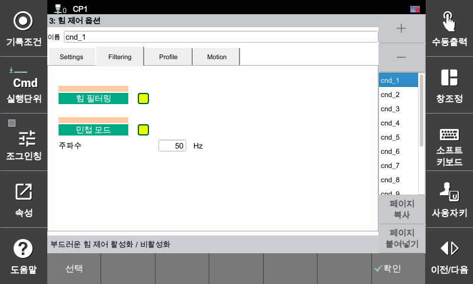

### 4.3 필터링

F/T 센서 데이터의 신호 노이즈를 억제하여 안정적인 제어 환경을 구축하는 필터 기능과, 시스템의 추종 성능을 극대화하기 위한 민첩 모드를 설정하는 메뉴입니다. 

[F2: 시스템] ➔ [4: 응용 파라미터] ➔ [24: 힘 제어] ➔ [3: 힘 제어 옵션] ➔ **[Filtering] 탭 선택**

---

#### **힘 필터링**

센서로부터 수집되는 힘/토크 신호의 고주파 노이즈를 감쇠시켜 로봇 동작의 흔들림을 방지하고 부드러운 접촉 거동을 제어합니다.

* **설정 방식:** 체크박스를 통해 활성화 여부를 선택합니다.



신호 품질이 우수한 F/T 센서를 사용할 때 필터 기능을 과도하게 적용하면 제어 루프 내에 위상 지연(Time Delay)이 발생할 수 있습니다. 이는 고속 힘 추종 응용 시 제어 성능 저하의 원인이 되므로, 고속 응용에서는 실제 신호 특성을 확인한 후 적용 여부를 결정하십시오.



---

#### **민첩 모드**

목표 힘에 도달하는 로봇의 초기 제어 반응 속도를 비약적으로 향상시키는 모드입니다. 툴(TCP)이 고속으로 이동하며 환경 변화에 즉각적으로 대응해야 하는 정밀 힘 제어 공정에서 필수적으로 활용됩니다.

| 설정 항목 | 설명 |
| :--- | :--- |
| **주파수 [Hz]** | 민첩 모드의 대역폭 동작 주파수를 지정합니다. 설정된 **주파수 값이 높을수록 로봇의 응답 속도가 빨라지고 민첩성**이 증가합니다. |



**민첩 모드(Agility Mode) 종료 특성**

* **주의 사양:** 민첩 모드는 `fctrl off`(종료) 시 그 자리에 무조건 **0.5초간 멈춘 뒤 종료**됩니다.

* **현장 문제:** 제품에 접촉한 채로 0.5초간 멈추면 표면에 압력이 계속 가해져 제품이 손상되거나 자국이 남을 수 있습니다.

* **보완 방법:** [5.6 예제 - 민첩 모드 종료 특성](../5-roblang/6-ex-agility-mode-end.md)





**진동 및 소음 유의:** 주파수 값을 크게 설정할수록 제어계의 응답성이 급격히 정밀해지지만, 로봇의 기계적 강성 및 환경 조건에 따라 고주파 소음이나 시스템 진동을 유발할 수 있습니다. 

**안전 구동 팁:** 최초 설정 시에는 시스템 안정성을 위해 낮은 주파수 대역에서 시작하여, 로봇의 거동과 소음을 모니터링하면서 점진적으로 주파수를 높여 최적의 제어 포인트를 찾으십시오.

