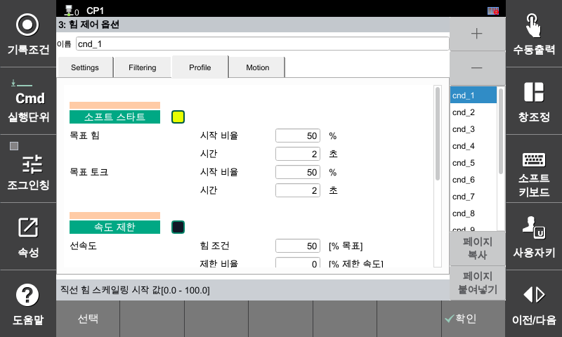
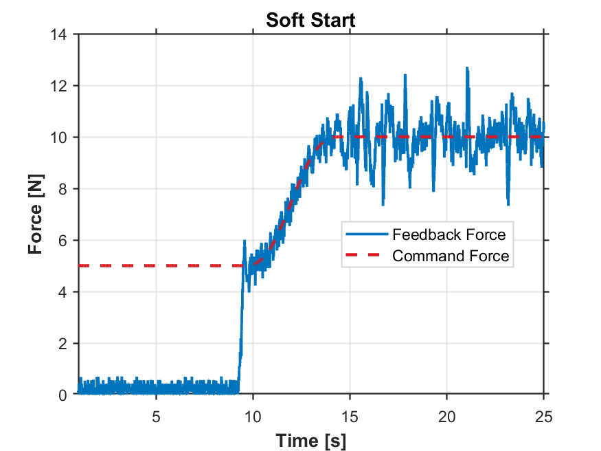

### 4.4.1 프로파일 : 소프트 스타트

로봇이 작업 대상물에 초기 접촉 및 진입할 때 발생할 수 있는 급격한 충격(Impact Force)을 방지하기 위한 기능입니다. 목표 제어값에 도달할 때 계단형(Step) 명령이 아닌 부드러운 곡선(Profile Curve) 형태로 목표 값을 점진적으로 인가합니다.

[F2: 시스템] ➔ [4: 응용 파라미터] ➔ [24: 힘 제어] ➔ [3: 힘 제어 옵션] ➔ **[Profile] 탭 선택**

---

##### **주요 설정 항목**

| 설정 항목 | 설명 |
| :--- | :--- |
| **기능 활성화** | 기능 사용 여부를 체크 박스로 지정합니다. |
| **시작 비율 [%]** | 기능이 트리거(동작 시작)되는 시점의 힘/토크 임계값을 최종 목표치 대비 백분율(%)로 설정합니다. 센서 측정값이 이 비율에 도달하면 프로파일 제어가 시작됩니다. |
| **시간 [s]** | 시작 비율 만족 시점부터 최종 목표 힘/토크 값에 완벽히 도달할 때까지 소요되는 프로파일 커브 시간(단위: 초)을 정의합니다. |

##### **동작 예시를 통한 이해**

아래 설정을 기준으로 한 실제 로봇의 튜닝 거동 예시입니다.

* **최종 목표 힘:** `10 N` (Settings 탭 Z축 설정값)
* **시작 비율:** `50 %` (최종 목표의 50%인 **5 N** 도달 시 기능 트리거)
* **프로파일 시간:** `5 s`

##### **Step 1. 초기 접촉 및 대기 (접촉 초기 단계)**
로봇이 하강하여 작업 대상물과 접촉을 시작하면 센서에 측정되는 현재 힘이 상승하기 시작합니다. 이때 실측 데이터가 트리거 기준점인 **5 N**에 도달하는 순간, 소프트 스타트 기능이 정식으로 활성화됩니다.

##### **Step 2. 프로파일 구간 진입 (프로파일 제어 단계)**
기능이 활성화된 시점부터 제어기는 명령 힘을 계단형(Step)으로 급격히 올리지 않습니다. 지정된 **5초 동안 부드러운 곡선 형태로 힘 명령을 점진적으로 증가**시키며, 최종 목표치인 10 N까지 로봇을 안정적으로 안착시킵니다.



**현장 활용 팁:** * 파손 위험이 높은 부품(유리, 디스플레이 등)을 조립하거나, 정밀 가공 표면에 초기 안착할 때 접촉 충격으로 인한 제품 결함 및 스크래치를 방지하기 위해 필수적인 설정입니다.

**현장 문제 해결 가이드** * 만약 초기 진입 시 쾅 치는 충격이 여전히 발생한다면, **[시작 비율]을 더 낮추어** 기능이 더 빨리 켜지게 하거나, **[시간] 값을 늘려** 가압 곡선을 더욱 완만하게 조정하십시오.



