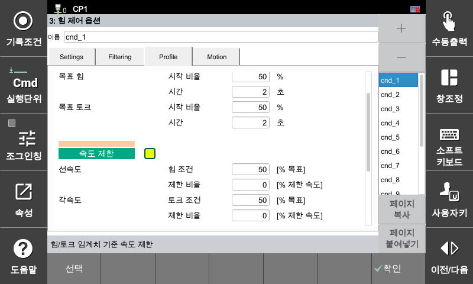
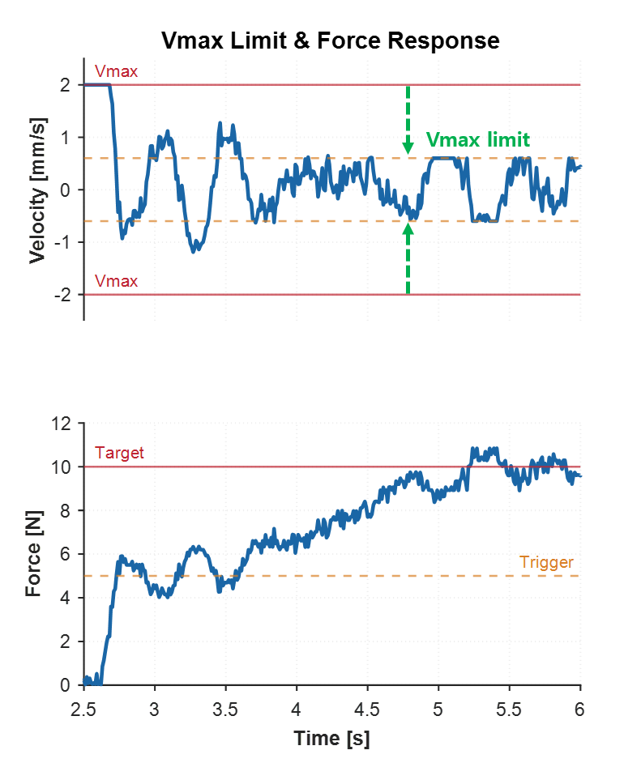

### 4.4.2 힘 제어 옵션 - 프로파일 : 속도 제한

속도 제한 명령을 특정 프로파일 형태로 조절하여 초기 접촉 성능을 개선하는 기능입니다.

[F2: 시스템] ➔ [4: 응용 파라미터] ➔ [24: 힘 제어] ➔ [3: 힘 제어 옵션] ➔ **[Profile] 탭 선택**

 

---

#### **속도 제한**

힘 제어 구동 중 로봇이 환경(물체)과 접촉할 때, 속도가 지나치게 빠르면 과도한 오버슈트와 제어계의 발산(진동)이 발생합니다. 본 기능은 현재 감지된 힘/토크 값이 사용자가 설정한 임계값을 초과하는 순간, 로봇의 최대 가동 속도(Vmax)를 더 낮은 수준으로 강제 클램핑하여 시스템의 기계적 진동과 충격을 근본적으로 억제하는 기능입니다.

#### **주요 설정 항목**

| 설정 항목 | 설명 |
| :--- | :--- |
| **기능 활성화** | 기능 사용 여부를 체크 박스로 지정합니다. |
| **선속도 - 힘 조건 [% 목표]** | 선속도 축(X, Y, Z)에 대한 트리거 조건입니다. 현재 힘이 [Settings] 탭에 설정된 최종 목표 힘 대비 설정된 백분율(%)에 도달하면 속도 제한이 즉시 수행됩니다. |
| **선속도 - 제한 비율 [% 제한 속도]** | 힘 조건 만족 시, 기존 [Settings] 탭에 설정된 축별 최대 제한 속도 대비 스케일링할 감쇠 비율(%)을 정의합니다. |
| **각속도 - 토크 조건 [% 목표]** | 회전축(Rx, Ry, Rz)에 대한 트리거 조건입니다. 현재 토크가 최종 목표 토크 대비 설정된 백분율(%)에 도달하면 속도 제한이 수행됩니다. |
| **각속도 - 제한 비율 [% 제한 속도]** | 토크 조건 만족 시, 기존 [Settings] 탭에 설정된 회전축 최대 제한 속도 대비 스케일링할 감쇠 비율(%)을 정의합니다. |

#### **동작 예시를 통한 이해**

* **기본 제한 속도 (Vmax):** `2.0 mm/s` ([Settings] 탭 설정값)
* **최종 목표 힘:** `10 N` ([Settings] 탭 설정값)
* **힘 조건 [% 목표]:** `50 %` (최종 목표의 50%인 **5 N** 도달 시 기능 트리거)
* **제한 비율 [% 제한 속도]:** `30 %` (기존 속도 한계의 30%인 **0.6 mm/s**로 하향 클램핑)

---

##### **Step 1. 초기 진입 및 힘 트리거**
로봇이 하강하여 대상물과 접촉한 후, 측정되는 실측 힘 데이터가 빠르게 상승하여 트리거 기준점인 **5 N**을 넘어서는 순간 속도 제한 알고리즘이 강제로 개입합니다.

##### **Step 2. 속도 클램핑 및 진동 억제**
기능이 켜지기 전 에는 로봇이 목표 힘을 추종하기 위해 Vmax 최대치인 $\pm2.0\,\text{mm/s}$ 부근까지 진동을 보이게 됩니다. 

하지만 힘 조건이 만족되어 제한 비율이 새롭게 설정되는 순간, 로봇의 가동 속도는 사전에 지정한 **$\pm0.6\,\text{mm/s}$ (기존 속도의 30%) 한계선 내부로 강력하게 클램핑(Vmax)** 됩니다. 결과적으로 제어계의 과도한 거동이 제한되면서 하단의 힘 데이터 역시 진동을 멈추고 목표치인 10 N에 안정적으로 수렴해 나갑니다.

---



* **현장 튜닝 가이드 (진동 제어):** 응답 또는 댐핑 조정만으로 초기 접촉 진동(튀는 현상)이 잡히지 않을 때 본 기능을 활성화하십시오. **[제한 비율]을 적절한 수준으로 하향 조정**하면 물리적인 속도 마진이 제한되어 진동을 효과적으로 억제할 수 있습니다.





* **과도한 제한 시 부작용:**
  [제한 비율]을 너무 낮게(예: 5% 이하) 설정하면 진동은 잡히지만, 로봇이 목표 힘까지 밀고 들어갈 수 있는 속도가 부족해집니다. 
  

