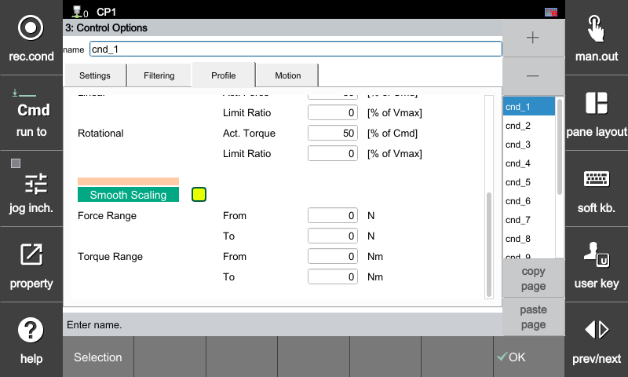
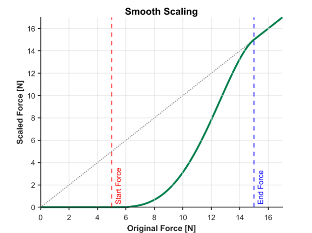
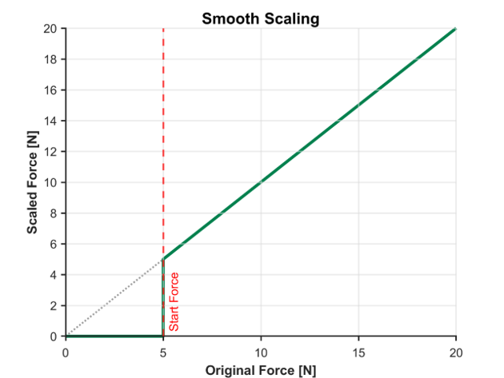

### 4.4.3 Profile: Force/Torque Scaling

This function blocks the force control loop from responding when the F/T sensor data is below a certain magnitude, and smoothly connects the output to the original target control line via a smooth curve or step form once it exceeds the threshold, thereby enhancing overall contact stability.

[F2: System] ➔ [4: Application Parameter] ➔ [24: Force Control] ➔ [3: Force Control Options] ➔ **Select [Profile] Tab**

---

##### **[Key Configuration Items]**

| Configuration Item | Description |
| :--- | :--- |
| **Function Activation** | Specifies whether to use the function via the checkbox. |
| **Force Range - Start [N]** | The lower limit where the deadband is applied. Measurements below this value are output as `0 N`. |
| **Force Range - End [N]** | The upper limit where the data synchronizes 1:1 with the original data. Measurements above this value are output directly without calibration. |
| **Torque Range - Start [Nm]** | The lower limit where the deadband is applied. Measurements below this value are output as `0 Nm`. |
| **Torque Range - End [Nm]** | The upper limit where the data synchronizes 1:1 with the original data. Measurements above this value are output directly without calibration. |

---

##### **[Understanding through Operation Examples]**

  

###### **Scaling (Start < End)**
* **Configuration Example:** Start `5 N` / End `15 N`

* **Operation Analysis:**
  
  A. **5 N or less:** The deadband is applied, outputting `0 N` to block fine noise and vibrations.
  
  B. **5 to 15 N:** The data is interpolated in the form of a smooth curve to prevent sudden data spikes.
  
  C. **15 N or more:** The original sensor values are reflected directly (1:1 linear) into the control loop without filtering.

---

###### **Step Scaling (Start ≥ End)**
* **Configuration Example:** Start `5 N` / End `0 N` (When the start value is greater than or equal to the end value)

* **Operation Analysis:**

  A. **Less than 5 N:** Treated as `0 N` because the measurement has not reached the threshold.
  
  B. **5 N or more:** Immediately jumps (Steps) to the original data line upon satisfying the criterion, and outputs the original values directly thereafter.

---



**Automatic Mode Switching:** If the [Start] value is greater than or equal to the [End] value, it operates in `Dead-Zone` mode without curve interpolation.

**On-Site Tuning Tip:** To block sensor noise caused by robot vibrations or external shaking, set the **[Start] value slightly higher than the maximum measured noise level** to secure an adequate deadband.

