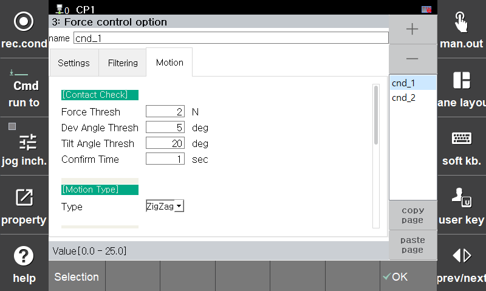

### 4.5.1 运动：接触条件

此功能实时检测并确定机器人工具中心点 (TCP) 在力控制操作期间是否稳定地与任务对象的表面接触（落在上面）。

[F2: 系统] ➔ [4: 应用参数] ➔ [24: 力控制] ➔ [3: 力控制选项] ➔ **选择 [运动] 标签**

---

##### **[关键配置项目]**

系统仅在满足以下配置的四个条件后，才将状态确定为“接触完成”。

| 配置项目 | 描述 |
| :--- | :--- |
| **力阈值 [N]** | 确认接触所需的最低施加力标准。 |
| **角度变化阈值 [deg]** | 初始接触时，力向量方向瞬时变化（变化幅度）的允许极限。 |
| **倾斜角度阈值 [deg]** | 在任务表面的坡度或工具的倾斜状态下，确定稳定接触的力向量的允许角度极限。 |
| **持续时间 [s]** | 上述三个阈值条件（力、角度变化和倾斜角度）必须持续保持的最短时间。 |

---

##### **[配置示例]** * **操作行为：** 如果以下条件 **同时满足 3 秒**，则最终确认工具已落在接触表面上。

| 配置项目 | UI 值 | 行为判断标准 |
| :--- | :--- | :--- |
| **力阈值** | `3 N` | 当 F/T 传感器检测到的外部力达到 3 N 或更高时 |
| **角度变化阈值** | `10 deg` | 当接触期间力方向的瞬时变化稳定在 10° 以内时 |
| **倾斜角度阈值** | `20 deg` | 当力向量相对于目标角度的倾斜轨迹在 20° 以内时 |
| **持续时间** | `3 s` | 当上述状态持续维持 3 秒而不间断时 |

---



**坐标系统配置规则：** 由于接触条件算法需要精确映射工具的行为方向和分量力，因此仅在参考坐标系统指定为 **工具坐标系统** 时正常运行。

**现场调整提示：** 如果机器人在接触后暂停并无法进行下一步动作，很可能是由于碰撞或表面不规则性造成的。在这种情况下，分别将 **[角度变化阈值]** 和 **[倾斜角度阈值]** 提高约 5° 至 10° 将解决问题并恢复正常操作。

