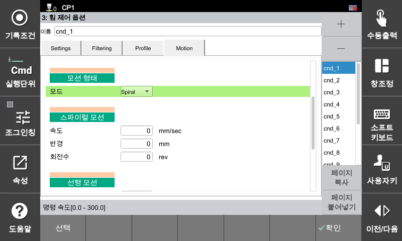
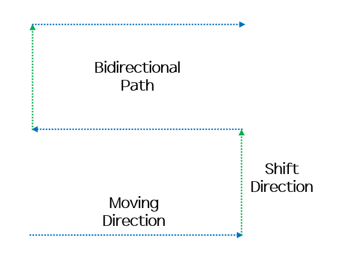
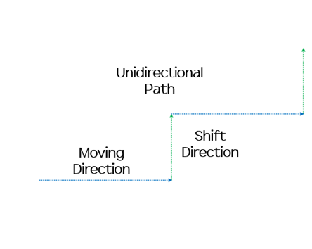

### 4.5.2 모션 : 자동 경로 생성

힘 제어 상태를 유지하면서 지정된 평면 상에 특정 패턴의 궤적을 자동으로 생성하며 이동하는 기능입니다.  

[F2: 시스템] ➔ [4: 응용 파라미터] ➔ [24: 힘 제어] ➔ [3: 힘 제어 옵션] ➔ **[Motion] 탭 선택**

---

##### **[모션 타입]**

사용 목적에 따라 총 3가지의 궤적 생성 모드를 제공합니다.

* **Spiral (나선형 모션):** 중심점부터 바깥쪽으로 원을 그리며 확장되는 궤적을 생성합니다. (ex: 연마, 폴리싱 공정)
* **Bidir (양방향 모션):** 왕복 이동을 하며 면을 채우는 궤적을 생성합니다. (ex: 넓은 면적의 표면 가공)
* **Unidir (단방향 모션):** 한 방향으로만 구동 후 복귀를 반복하는 궤적을 생성합니다. (ex: 일정한 결 유지가 필요한 샌딩, 디스펜싱 공정)

---

###### **1. Spiral (나선형 모션)**

중심점에서 시작하여 동심원 형태로 반경을 넓혀가는 경로를 생성하는 기능입니다.  

| 항목명 | 설명 |
| :--- | :--- |
| **속도** | 나선 궤적을 이동하는 TCP 선속도 (단위: mm/sec) |
| **반경** | 최종 확장될 나선의 최대 반지름 (단위: mm) |
| **회전수** | 시작점부터 종료점까지 회전하는 총 횟수 (단위: rev) |

---

###### **2. Bidir (양방향 모션)**

끝단 가공 방향을 바꾸며 왕복 형태의 연속적인 선형 경로를 생성하는 기능입니다.  

| 항목명 | 설명 |
| :--- | :--- |
| **속도** | 경로를 이동하는 TCP 선속도 (단위: mm/sec) |
| **이동 방향** | 메인 가공 구동 방향 (+X, -X, +Y, -Y) |
| **이동 길이** | 메인 가공 경로의 1회 스케일 거리 (단위: mm) |
| **줄바꿈 방향** | 다음 라인으로 건너뛰는 피치(Pitch) 이동 방향 (+X, -X, +Y, -Y) |
| **줄바꿈 길이** | 다음 라인과의 간격(Pitch) 거리 (단위: mm) |
| **모서리 반경** | 라인이 꺾이는 모서리 구간의 라운딩 반경 (단위: mm) |



**모서리 반경 설정 제한:** 모서리 반경의 최댓값은 [이동 길이]와 [줄바꿈 길이] 중 작은 값의 절반을 초과할 수 없습니다.



---

###### **3. Unidir (단방향 모션)**

항상 일정한 정방향 구동을 유지하기 위해, 편도 이동 후 공구를 떼고 원점으로 복귀하여 라인을 바꾸는 경로 생성 기능입니다.  

| 항목명 | 설명 |
| :--- | :--- |
| **속도** | 경로를 이동하는 TCP 선속도 (단위: mm/sec) |
| **이동 방향** | 단방향 가공 구동 방향 (+X, -X, +Y, -Y) |
| **이동 길이** | 1회 편도 가공 경로의 거리 (단위: mm) |
| **줄바꿈 방향** | 다음 라인으로 건너뛰는 피치(Pitch) 이동 방향 (+X, -X, +Y, -Y) |
| **줄바꿈 길이** | 다음 라인과의 간격(Pitch) 거리 (단위: mm) |
| **줄 개수** | 지정된 이동 방향과 줄바꿈 길이에 따라 생성할 총 라인의 수 (단위: ea) |

---



**좌표계 가이드:** 모든 자동 경로 생성(Spiral, Bidir, Unidir)은 힘 제어 좌표계 설정 항목에서 지정한 **기준 좌표계의 XY 평면**을 기준으로 2차원 궤적을 계산합니다. 

