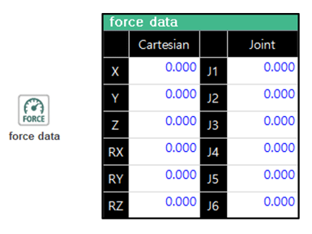

## 🧩 4.1 Force Data Monitoring

This function allows you to monitor the external force applied to the robot in real time.  
It is essential to check this information when using the Force Control function.

---

| Item         | Description |
|--------------|-------------|
| **Cartesian** | External force (N or Nm) displayed in the selected coordinate system |
| **Joint**     | Not used in force control |

> ⚠️ The coordinate system of the `Cartesian` external force follows the coordinate frame defined in the force control condition (`cnd`).

> ⚠️ Data is updated **only when force control (fctrl) is active**.

### TP Navigation Path

**[Operation]** → **[Select]** → **[Force Data Monitoring]**
