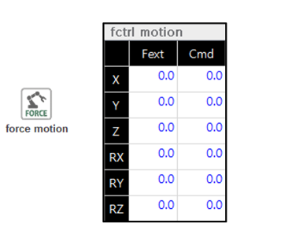

## 🧩 4.2 힘 모션 모니터링

| 항목명       | 설명 |
|--------------|------|
| **Fext**     | 힘 오차(목표 힘과 외력 간의 오차) [N 또는 Nm]|
| **Cmd**      | 힘 제어를 위한 명령 위치 (mm 또는 deg) |

> ⚠️ `Fext`와 `Cmd`의 좌표계는 설정(`cnd`)에서 선택한 좌표계 기준을 따른다.