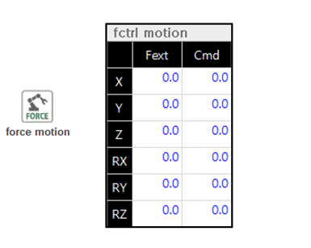

# 🧩 4. 모니터링

센서 기반 힘 제어 기능이 동작 중일 때,  
사용자는 UI를 통해 다음과 같은 상태 정보를 실시간으로 확인할 수 있습니다.

  

---

## ✅ 힘 데이터 모니터링 

| 항목명       | 설명 |
|--------------|------|
| **Cartesian**| 외력 힘(N 또는 Nm)|
| **Joint**    | 힘 제어에서는 사용하지 않은 항목 |

> ⚠️ `Cartesian` 외력 힘의 좌표계는 설정(`cnd`)에서 선택한 좌표계 기준을 따른다.

  

---

## ✅ 힘 모션 모니터링 

| 항목명       | 설명 |
|--------------|------|
| **Fext**     | 힘 오차(목표 힘과 외력 간의 오차) [N 또는 Nm]|
| **Cmd**      | 힘 제어를 위한 명령 위치 (mm 또는 deg) |

> ⚠️ `Fext`와 `Cmd`의 좌표계는 설정(`cnd`)에서 선택한 좌표계 기준을 따른다.