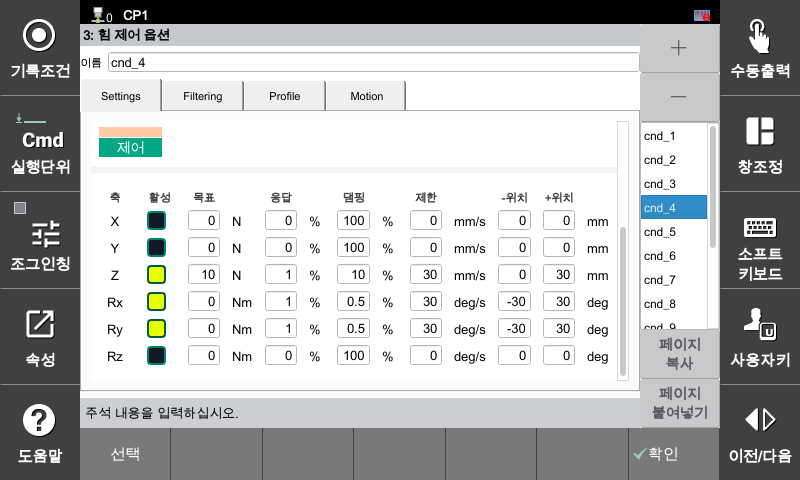
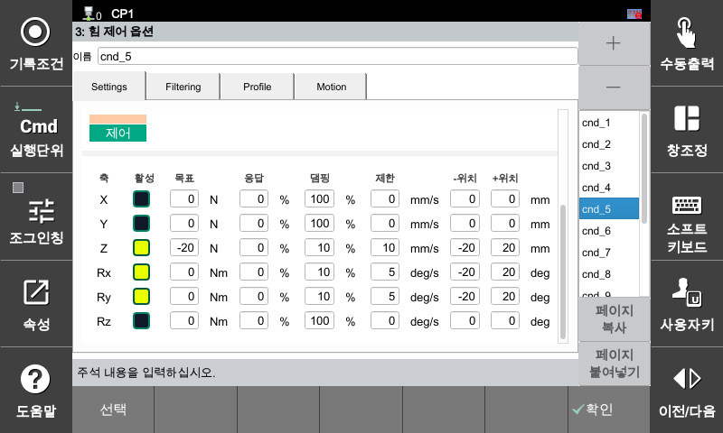

## 5.6 Methods to Work Around Agility Mode Termination Characteristics

Agility Mode has a specification where it unconditionally **pauses for 0.5 seconds** at that specific point before terminating when the `fctrl off` (termination) command is executed. 

* **Expected Issue:** If control is terminated while maintaining contact with the surface immediately after machining or dispensing is completed, the pressure is maintained for 0.5 seconds, which may damage the product surface or leave marks.

* **Solution:** Since position offset commands (`shift`) cannot be used during force control, you must switch in real time to a **workaround condition (cnd) that applies a force in the direction opposite to the pressurizing direction** before executing `fctrl off` to detach the robot from the surface first. Afterwards, it safely terminates following a 0.5-second pause in a non-contact (air) state.

---

##### **[Condition Settings Configuration]**

* **Main Control Condition (cnd=4):** A condition that activates Agility Mode to perform surface machining and automatic path motions.

* **Workaround Condition (cnd=5):** A condition configured to escape in the direction opposite to the main pressurizing direction to prevent product damage.


*▲ Figure: Main force control condition (cnd=4) configuration screen with Agility Mode activated*


*▲ Figure: Workaround condition (cnd=5) configuration screen set to apply an external force in the opposite direction for surface detachment*


---

##### **[JOB Program]**

```python
# Move to home position and machining approach position
S1   move P,spd=5%,accu=0,tool=0  
S2   move L,spd=5%,accu=0,tool=0  
     delay 2
     
# Execute main force control and automatic path
     fctrl on,cnd=4                # Start main force control (Agility Mode)
     wait _fctrl.contact,20        # Wait for surface contact completion (Timeout 20 seconds)
     fctrl motion_on               # Start automatic path generation motion
     wait _fctrl.motion==0         # Wait until motion path is complete
    
# Escape sequence in the opposite direction for product protection
     fctrl control,cnd=5           # Switch in real time to the workaround condition in the direction opposite to the contact surface (air)
     delay 2                       # Wait until the robot completely detaches from the surface
     
# Safe termination in a non-contact state
     fctrl off                     # Terminate force control (Since it is in a non-contact state, the 0.5-second pause has no impact on the product)
     delay 1
  
end